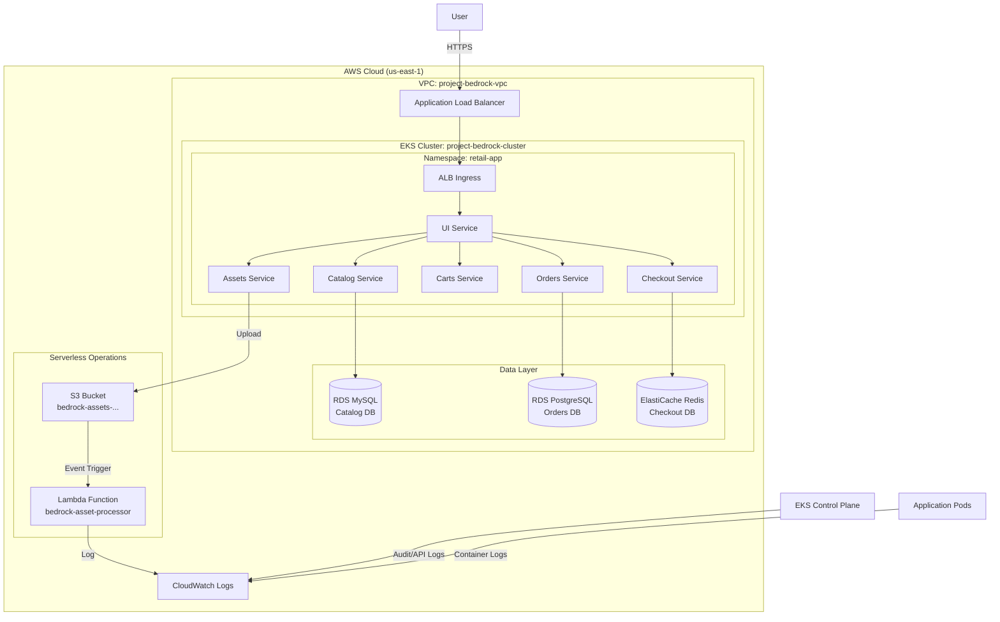

# Project Bedrock Architecture

High-level architecture of the Retail Store infrastructure on AWS EKS.

## System Diagram

## Developer Access

*   **IAM User**: `bedrock-dev-view`
*   **Console Access**: ReadOnlyAccess
*   **Cluster Access**: `view` ClusterRole (mapped via Access Entry)
