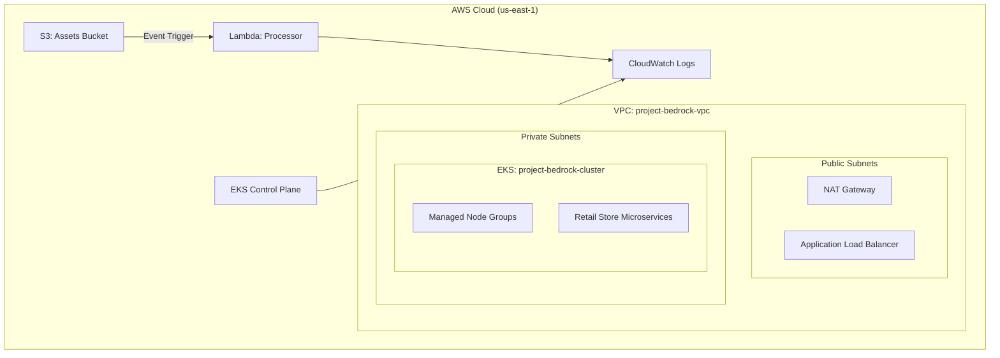

# InnovateMart: Project Bedrock 🚀

**Mission:** Provision a production-grade AWS EKS cluster and deploy the [AWS Retail Store Sample App](https://github.com/aws-containers/retail-store-sample-app).

---

## 🏗️ Architecture Overview

This project implements a secure, scalable microservices environment on AWS using Terraform.



---

## 📁 Project Structure

| Folder | Responsibility |
| :--- | :--- |
| **`terraform/`** | Infrastructure as Code (VPC, EKS, IAM, S3, Lambda) |
| **`k8s/`** | Kubernetes Namespace and configuration manifests |
| **`lambda/`** | Python source code for the asset processor Lambda |
| **`scripts/`** | Deployment scripts for the Helm chart |
| **`.github/`** | CI/CD Workflows for automated Terraform Plan/Apply |

---

## 🚀 Getting Started

### 1. Prerequisites
- AWS CLI configured with administrator permissions.
- Terraform >= 1.5.0 installed.
- Kubectl and Helm installed locally.

### 2. Infrastructure Deployment
Navigate to the `terraform` directory and initialize:
```bash
cd terraform
terraform init
terraform plan
terraform apply --auto-approve
```

### 3. Application Deployment
Once the EKS cluster is ready, run the deployment script:
```bash
./scripts/helm-install.sh
```

### 4. Verify Access
Configure your `kubeconfig`:
```bash
aws eks update-kubeconfig --region us-east-1 --name project-bedrock-cluster
kubectl get pods -n retail-app
```

---

## 🛡️ Security & Observability

- **developer Access**: An IAM user `bedrock-dev-view` is created with Console ReadOnly access and Kubernetes RBAC `view` role for the `retail-app` namespace.
- **Logging**: EKS Control Plane logs and Container logs are shipped to **Amazon CloudWatch**.
- **Event-Driven**: Uploading images to the S3 bucket triggers the Python Lambda function, logging file metadata to CloudWatch.

---

## 📊 Grading Data
The `grading.json` file in the root directory contains the infrastructure metadata required for the automated grading script.

```bash
terraform output -json > grading.json
```

---
*Developed for InnovateMart Inc. Project Bedrock.*
