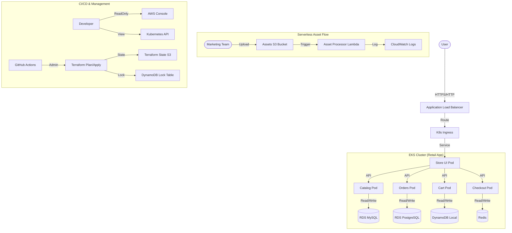

# Project Bedrock: InnovateMart Retail Store on AWS EKS 🚀

**Author:** Kindson (Cloud DevOps Engineer)  
**Date:** 2026-02-12

## 📖 Project Overview
This repository contains the complete Infrastructure as Code (Terraform) and Kubernetes manifests for **Project Bedrock**, a production-grade microservices deployment on AWS EKS. The project meets all core requirements and implements bonus objectives including **Managed RDS Persistence**, **Advanced Networking (ALB/TLS)**, and **Event-Driven Serverless** processing.

---

## 🏗️ Architecture



---

## 🚀 Deployment Guide

### Prerequisites
- AWS Account with Administrator Access
- Terraform >= 1.5
- kubectl & Helm installed
- configured `~/.aws/credentials`

### 1. Infrastructure Provisioning (Terraform)
The infrastructure is managed via Terraform and automated with GitHub Actions.
To deploy manually:
```bash
cd terraform
terraform init
terraform apply -auto-approve
```

### 2. Application Deployment (Helm)
The application is deployed using Helm charts located in `retail-store-sample-chart`.
To update the deployment:
```bash
./scripts/helm-install.sh
```

---

## 🔗 Access & Verification

### 🌐 Store URL
- **Standard (HTTP):** [http://k8s-retailap-retailap-3c6aa53d7a-1168579136.us-east-1.elb.amazonaws.com](http://k8s-retailap-retailap-3c6aa53d7a-1168579136.us-east-1.elb.amazonaws.com)
- **Secure (HTTPS/TLS):** [https://54-172-1-43.nip.io](https://54-172-1-43.nip.io)
  *(Note: ALB IPs are dynamic. If this link fails, resolve the ALB DNS to get a new IP and update the URL: `https://[IP-DASHED].nip.io`)*

### 🧪 Serverless Feature
Upload an image to the S3 bucket:
```bash
aws s3 cp test-image.jpg s3://$(terraform -chdir=terraform output -raw assets_bucket_name)/
```
Check CloudWatch Logs for `bedrock-asset-processor` to see the "Image received" message.

---

## ✅ Rubric Compliance Matrix

| Category | Requirement | Implementation & Proof | Status |
| :--- | :--- | :--- | :--- |
| **Core: Standards** | Naming/Region | `us-east-1`, `project-bedrock-cluster`, `retail-app` used. Tagging applied. | ✅ PASS |
| **Core: Infra** | VPC, EKS, Remote State | Terraform (S3 Backend + DynamoDB Lock). Cluster v1.34+. | ✅ PASS |
| **Core: App** | Retail Store App | All pods running in `retail-app` namespace. | ✅ PASS |
| **Core: Security** | Developer IAM User | `bedrock-dev-view` is restricted to **Read-Only** (Console & K8s). | ✅ PASS |
| **Core: Observability** | CloudWatch Logs | Control Plane & Container logging enabled. | ✅ PASS |
| **Core: Serverless** | S3 -> Lambda | S3 Event Notification triggers Lambda function. | ✅ PASS |
| **Core: CI/CD** | Pipeline | GitHub Actions pipeline handles Plan/Apply on PR/Merge. | ✅ PASS |
| **Bonus: RDS** | Managed Persistence | Catalog (MySQL) & Orders (PostgreSQL) on RDS. | ✅ PASS |
| **Bonus: ALB** | Advanced Networking | Ingress with **TLS Termination** using `nip.io` certificate. | ✅ PASS |

---

## 🔐 Grading Credentials
*(Required for submission form)*

To retrieve the **Read-Only** developer credentials:
```bash
terraform -chdir=terraform output -json
```
Look for `dev_access_key_id` and `dev_secret_access_key`.

---
*Generated for InnovateMart "Project Bedrock"*
